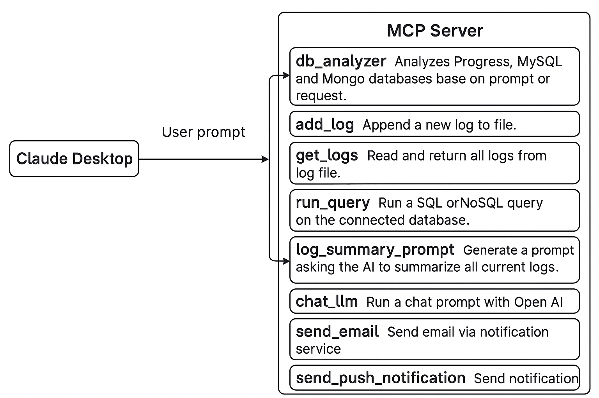

# Basic MCP Server

## Overview

Basic MCP Server is a comprehensive platform that analyzes your Postgres, MySQL, and MongoDB databases. The server integrates with Claude Desktop, enabling powerful AI-assisted database analysis through Claude's interface.

## Key Features

- **Database Analysis**: Connect to and analyze multiple database types (Postgres, MySQL, MongoDB)
- **Action Logs**: Track and monitor all database interactions
- **LLM Ethical Safety Integration**: Ensure safe and responsible database queries
- **Communication Tools**: Built-in functionality to send emails and SMS notifications
- **Claude Desktop Integration**: Seamless interaction with Claude AI for database analysis


## MCP Server Process Diagram

The diagram below illustrates how Claude Desktop interacts with MCP Server tools based on user prompts.



## Installation

### Prerequisites

1. **Python 3.12 or higher**:
   ```bash
   uv python install
   ```

2. **Install uv package manager**:
   #### macOS and Linux 
   ```bash
   curl -LsSf https://astral.sh/uv/install.sh | sh
   ```
   #### Windows
   ```bash
   powershell -ExecutionPolicy ByPass -c "irm https://astral.sh/uv/install.ps1 | iex"
   ```  
   #### For more installation options
   Visit https://docs.astral.sh/uv/getting-started/installation/

3. **Download Claude Desktop**:
   https://claude.ai/download

### Server Setup

1. **Clone the repository**:
   ```bash
   git clone https://github.com/yourusername/basic-mcp-server.git
   cd basic-mcp-server
   ```

2. **Create and activate virtual environment**:
   ```bash
   rm -rf .venv
   uv venv .venv
   source .venv/bin/activate  # On Windows: .venv\Scripts\activate
   ```

3. **Install dependencies**:
   ```bash
   uv run mcp
   ```

4. **Configure database connection**:
   Create a `.env` file with the following parameters:
   ```
   # PostgreSQL configuration
   DB_HOST=your_db_host/ip
   DB_PORT=5432
   DB_NAME=your_db_name
   DB_USER=your_db_user    
   DB_PASSWORD=your_db_password

   # MySQL configuration
   MYSQL_DB_HOST=your_db_host/ip
   MYSQL_DB_PORT=3306
   MYSQL_DB_NAME=your_db_name
   MYSQL_DB_USER=your_db_user
   MYSQL_DB_PASSWORD=your_db_password

   # MongoDB configuration
   MONGODB_CONNECTION_STRING=your_mongodb_connection_string
   MONGODB_DATABASE=your_mongodb_database

   # OpenAI API configuration (for supplementary LLM features)
   OPENAI_API_KEY=sk-proj-...
   OPENAI_MODEL=gpt-4o-mini

   # Web notification URL
   BASE_URL=your_web_notification_url
   ```

## Claude Desktop Integration

1. **Install MCP to Claude Desktop**:
   ```bash
   uv run mcp install main.py
   ```

2. **Test with MCP Inspector (development mode)**:
   ```bash
   uv run mcp dev main.py
   ```

3. **Configure Claude Desktop settings**:
   Add/review the following configuration of your Claude Desktop:
   ```json
   "Basic MCP Server": {
     "command": "uv",
     "args": [
       "run",
       "--python",
       "/path/to/your/basic-mcp-server/.venv/bin/python3",
       "--with",
       "mcp[cli]",
       "mcp",
       "run",
       "/path/to/your/basic-mcp-server/main.py"
     ]
   }
   ```

## Security Considerations

1. **Restricted Database Permissions**:
   - Only read operations (eg. SELECT, FIND) database are permitted for the LLM tools

2. **Secure Environment Variables**:
   ```bash
   chmod 600 .env
   ```

## Troubleshooting Claude Desktop Connection

If Claude Desktop cannot connect to your MCP server:

1. **Force Quit and Restart Claude Desktop**

2. **Verify the MCP Path in Claude Settings**:
   Ensure the path to your Python environment is correct:
   ```json
   "Basic MCP Server": {
     "command": "uv",
     "args": [
       "run",
       "--python",
       "/Users/yourusername/Documents/Dev/Python/mcp-server/.venv/bin/python3",
       "--with",
       "mcp[cli]",
       "mcp",
       "run",
       "/Users/yourusername/Documents/Dev/Python/mcp-server/main.py"
     ]
   }
   ```

3. **Hard-code the uv Path**:
   - Run `which uv` to find the exact path
   - Update the Claude settings:
   ```json
   "Basic MCP Server": {
     "command": "/Users/yourusername/.local/bin/uv",
     "args": [
       "run",
       "--python",
       "/Users/yourusername/Documents/Dev/Python/mcp-server/.venv/bin/python3",
       "--with",
       "mcp[cli]",
       "mcp",
       "run",
       "/Users/yourusername/Documents/Dev/Python/mcp-server/main.py"
     ]
   }
   ```

## Usage Guide

Your knowledge of the database is key to make the best of this MCP server tools.

1. **Connect to Claude Desktop**:
   - Open Claude Desktop
   - Select "Basic MCP Server" from the tools menu

2. **Query Your Databases**:
   - Ask Claude to analyze data from your configured databases
   - Example: "Show me the top 10 users by transaction volume in the last month"

3. **Generate Reports**:
   - Request various reports based on your database data
   - Example: "Generate a monthly financial report based on the transactions table"

### Sample Analytics Prompt

Here's a sample prompt you can use with Claude Desktop to analyze your database:

```
You are an expert data analyst specializing in database and business intelligence. Your task is to provide a detailed, insightful, and actionable health analysis based on available database records.

**Key Notes for Analysis**: 
- Focus on the following transactional data:
   * **PostgreSQL**: Analyze the `transactions` table
      - Ignore any tables ending with `_table` (migration tables)
      - Ignore any records where `actionBy = 'system'`
   * **MongoDB**: For the `transactions` collection, use:
      * `inflow = credit`
      * `outflow = debit`

**Expected Output**: 
- Provide a markdown-formatted report
- Include KPIs such as:
   - Active users
   - Revenue inflow vs outflow (net cash position)
   - Transaction volume trends
   - Customer retention
   - Product usage distribution
   - Any potential anomalies or recommendations

Make your analysis structured and insightful enough for use in a business review or investor update.
```

## Contributing

We welcome contributions to the Basic MCP Server project:

1. Fork the repository
2. Create a feature branch: `git checkout -b feature/amazing-feature`
3. Commit your changes: `git commit -m 'Add some amazing feature'`
4. Push to the branch: `git push origin feature/amazing-feature`
5. Open a Pull Request

<a href="https://www.buymeacoffee.com/seunope" target="_blank"></a>

## License

This project is licensed under the MIT License - see the LICENSE file for details.

## Support

For support and inquiries, please contact us at alocmass@gmail.com
